# Poneglyph

**Institutional memory for development consulting projects.**

A multi-agent system on Claude Opus 4.7 that reads scattered field evidence, catches silent commitment drift across stakeholder meetings, and drafts pre-meeting briefings — every claim cited, every fact independently audited.

Built in five days for the [Built with Opus 4.7 Hackathon](https://cerebralvalley.ai) · April 2026.

---

**Live demo:** https://poneglyph-chi.vercel.app  
**Video:** [3-min demo on YouTube](VIDEO_URL_HERE)  
**Stack:** Python 3.12 · FastAPI · Next.js 14 · Anthropic Claude Opus 4.7

---

## Table of contents

- [What it does](#what-it-does)
- [The six agents](#the-six-agents)
- [Three Opus 4.7 capabilities](#three-opus-47-capabilities)
- [Architecture](#architecture)
- [Evaluation](#evaluation)
- [Failure modes](#failure-modes)
- [How to run locally](#how-to-run-locally)
- [Deployment](#deployment)
- [Why this exists](#why-this-exists)
- [What's next](#whats-next)

---

## What it does

A typical donor-funded development project — say a five-year, $40M World Bank farmer producer company program in central India — generates evidence faster than any team can structure it. Field officers submit paper registration forms in Hindi. Block coordinators send WhatsApp updates with phone-camera photos. State managers log meetings in Word documents. Donors receive quarterly reports compiled by hand. Nothing links to the logframe. Nothing cross-checks itself.

When the World Bank Independent Evaluation Group review lands six months later and asks *"you committed to 50 AgriMarts by Q3 — what happened to the other 8?"*, the answer takes a senior partner three days of frantic searching. The IEG flags "weak evidence trails between commitments and reported deliverables" as a top-three reason for project rating downgrades.

Poneglyph fixes this. Drop in your project's documents — scanned forms, meeting transcripts, CSV exports. Six specialized agents read everything, build a structured project memory, detect silent commitment drift across stakeholder meetings, and on demand generate a one-page briefing for the next donor meeting. Every claim cites a specific evidence ID, commitment ID, or meeting transcript. The Auditor agent independently re-reads source images to verify every fact and refuses to confirm any claim it cannot ground.

Replaces a senior consultant's full Sunday of pre-meeting prep with a 30-second briefing.

---

## The six agents

| Agent | Role | Capability |
|---|---|---|
| **Scout** | Reads scanned forms | Pixel-coordinate vision on Hindi + English documents, mapped to logframe indicators |
| **Scribe** | Processes meeting transcripts | Structured minutes, commitments with owner + deadline, decisions, open questions |
| **Archivist** | Holds project memory | File-system memory via on-demand tool reads, cross-meeting drift detection |
| **Drafter** | Writes report sections | Donor-format atomic claims, every claim referenced to source IDs |
| **Auditor** | Independently verifies | Vision re-reads source images, refuses to confirm what it cannot ground |
| **Briefing** | Generates pre-meeting prep | Push-for, push-back, don't-bring-up structure with full citations |

Coordinated by a deterministic Python orchestrator with SSE streaming and structured outputs. Not a meta-agent.

---

## Three Opus 4.7 capabilities

The judging criterion asked for *"capabilities that surprised even us."* Here are three that came out of this build.

### 1. Pixel-coordinate vision on handwritten non-English forms

Scout extracts evidence from scanned field documents — including bilingual Hindi-English attendance registers, government-stamped registration forms, and inspection reports. The model returns structured evidence with bounding box coordinates pointing to the exact pixel region where each fact appeared. No OCR pipeline. No fine-tuning. Nothing in the training set looks like an Indian Krishi Vigyan Kendra (KVK) attendance register.

12 / 12 evidence extractions on the synthetic eval set, 100% bounding-box validity. See [`backend/agents/scout.py`](backend/agents/scout.py) and [`evals/scout_eval/`](evals/scout_eval/).

### 2. File-system memory through on-demand tool reads

Archivist does not get the project context in its prompt. It gets a tool that lets it read files on demand. When asked *"have any commitments shifted across meetings?"*, the agent decides which transcripts to open, in what order, and stops when it has the answer. The model uses the file system the way a human consultant uses a project binder.

This is fundamentally different from RAG. There is no vector store. There is no retrieval step. The model navigates a real file tree and decides what to look at next based on what it has already read. 3 / 3 reliability on the AgriMart walk-back across variance runs. See [`backend/agents/archivist.py`](backend/agents/archivist.py).

### 3. Independent self-verification through vision

The Drafter writes claims for the donor report. The Auditor — same model, different role, separate context — re-reads the original source images and verifies each claim independently. Out of 16 claims drafted on the canonical run, 14 verified, 1 contested, 1 unsupported.

The Auditor refuses to confirm any claim it cannot ground in source evidence. In testing, it caught a fabricated date the Drafter had hallucinated and tagged it `unsupported`. Same model, two different roles, with vision, refusing to lie. See [`backend/agents/auditor.py`](backend/agents/auditor.py).

---

## Architecture

### AI architecture — two flows on six agents



The **canonical pipeline** runs when documents are ingested: Scout and Scribe extract evidence, Archivist remembers, Drafter writes report sections, Auditor verifies them. The **on-demand briefing** runs when the user asks for a pre-meeting brief: Briefing reads project memory and generates structured push-for / push-back / don't-bring-up output with full citations.

### Deployed system (C4 Container)



Frontend on Vercel (Next.js 14 App Router). Backend on Railway (FastAPI on uvicorn, Python 3.12). The backend service contains the orchestrator, the six agents, and the Briefing endpoint, all reading and writing to a project memory filesystem. All Anthropic API calls go from Railway to Claude Opus 4.7.

### System context (C4 Context)



Senior consultants and field staff use Poneglyph to manage donor-funded development projects. Project data — forms, transcripts, CSVs — flows in. Briefings and reports flow out to the World Bank, GIZ, UN, and other donors. Anthropic Claude Opus 4.7 powers the reasoning layer.

### Key technical choices

- **Sequential pipeline with selective parallelization.** Scout and Scribe run concurrently (independent inputs). Auditor's per-claim vision verifications run on a `ThreadPoolExecutor` (10-15 independent API calls). The rest is deterministic sequence — predictable SSE event ordering matters more than wall-clock speed.
- **Structured outputs everywhere.** Every agent returns Pydantic-validated JSON. Schema mismatches caught at boundary, not deep in business logic.
- **Tool-use loops with bounded rounds.** Archivist and Auditor get up to 6 tool rounds. Drafter gets 5. Empirically, agents converge in 2-3 rounds; the ceiling exists for safety, not normal flow.
- **Evidence-first prompting.** Every agent is instructed to fail closed: when in doubt, return `unknown` or `unsupported` rather than guess. The Auditor's refusal-to-verify behavior comes from this discipline applied to the system prompt.
- **No vector database.** Claude Opus 4.7's tool-use loop reads files directly from disk. The project memory is a real file tree at `backend/data/projects/<project-id>/`.

---

## Evaluation

Every agent is eval'd against synthetic test cases with documented pass criteria. Honest numbers — not vibes.

| Agent | Eval set size | Pass rate | Notes |
|---|---|---|---|
| Scout (vision extraction) | 12 | 12 / 12 (100%) | Synthetic typed forms only — see [Failure modes](#failure-modes) |
| Scribe (transcripts) | 5 | 4 / 5 (80%) | One failure on long transcripts (>4K tokens) |
| Auditor (verification) | 8 | 6 / 8 (75%) | CONTESTED → UNSUPPORTED tagging is genuinely hard |
| Archivist (contradictions) | 3 | 3 / 3 (100%) | AgriMart walk-back variance-tested |
| **Aggregate** | **28** | **25 / 28 (89%)** | |

Variance testing: the canonical drift detection (50 → 42 AgriMart walk-back) was run 3 times to confirm reliability across non-deterministic model outputs. 3 / 3.

Full methodology and per-test breakdowns: [`EVALS.md`](EVALS.md).

---

## Failure modes

Seven documented limitations with mitigations. Most teams hide what doesn't work. We documented it.

1. **Scout has only been tested on synthetic typed forms.** Real handwritten Devanagari with degraded photo quality is unverified.
2. **Scribe degrades on transcripts over ~4K tokens.** Chunking strategy not yet implemented.
3. **Auditor confuses CONTESTED with UNSUPPORTED in adversarial cases.** Genuinely hard reasoning task — known limitation.
4. **No deduplication of evidence.** If the same fact appears in two source documents, it appears as two evidence items.
5. **No multilingual support beyond Hindi-English.** Bengali, Tamil, Marathi forms are out of scope.
6. **No real-time collaboration.** Single-user tool; concurrent project edits would race.
7. **Synthetic data only.** No real-user trial yet.

Full details and intended mitigations: [`FAILURE_MODES.md`](FAILURE_MODES.md).

---

## How to run locally

Requires Python 3.12, Node.js 18+, an Anthropic API key.

```bash
# Clone
git clone https://github.com/vedntzz/Poneglyph.git
cd Poneglyph

# Backend
cd backend
python3.12 -m venv .venv
source .venv/bin/activate
pip install -r requirements.txt
export ANTHROPIC_API_KEY=sk-ant-...
uvicorn main:app --reload  # → http://localhost:8000

# Frontend (new terminal)
cd frontend
npm install
npm run dev  # → http://localhost:3000
```

Open http://localhost:3000, click *Try the demo*, expand the Engine, click *Run Canonical Demo*. The canonical pipeline runs on synthetic Madhya Pradesh Farmer Producer Company project data in approximately 5-7 minutes on Opus 4.7.

---

## Deployment

- **Frontend:** Vercel · Next.js 14 App Router · `frontend/` is the deployed root
- **Backend:** Railway · FastAPI on uvicorn · Python 3.12 · deploy from repo root with `Procfile`
- **Source:** GitHub at [vedntzz/Poneglyph](https://github.com/vedntzz/Poneglyph)
- **License:** MIT

Live URLs:
- Web app: https://poneglyph-chi.vercel.app
- API: https://web-production-05e92.up.railway.app
- API docs: https://web-production-05e92.up.railway.app/docs

---

## Why this exists

$200B+ in official development assistance flows annually from the World Bank, GIZ, USAID, and UN agencies into rural development consulting projects (OECD DAC, 2023). Mid-market Indian consulting firms running ₹50–500 crore agriculture, livelihoods, and infrastructure programs are the segment that can't afford bespoke MIS but can't afford evidence gaps either. World Bank IEG reviews increasingly cite "weak evidence trails" as a project-rating-downgrade trigger.

The author has direct exposure to this sector — sixteen years of family involvement in Indian agribusiness consulting on World Bank and government programs, with on-the-ground familiarity with the documentation workflows this product replaces.

Development consulting is the wedge. The same scattered-evidence problem exists in construction project management, agri co-ops, public health monitoring, and humanitarian response — wherever the real economy meets donor reporting.

---

## What's next

This was a five-day hackathon submission. Real product development would prioritize:

1. **Real-data testing** with willing partner consulting firms (synthetic data has a ceiling).
2. **Multilingual expansion** — Bengali, Tamil, Marathi, Swahili.
3. **Collaboration layer** — multiple consultants editing the same project memory.
4. **Donor-format export presets** — World Bank ISR, GIZ progress report, UNDP RBM templates.
5. **Hardened deployment** — auth, RBAC, audit logs, on-prem option for sensitive projects.

If you run a development consulting firm and want to try this on a real project, reach out.

---

## Acknowledgements

Built for the [Cerebral Valley × Anthropic Built with Opus 4.7 Hackathon](https://cerebralvalley.ai), April 2026.

Claude Opus 4.7 by [Anthropic](https://www.anthropic.com).

Open source under MIT.

---

*Poneglyph: from One Piece, the indestructible stones that hold scattered truth across time.*
